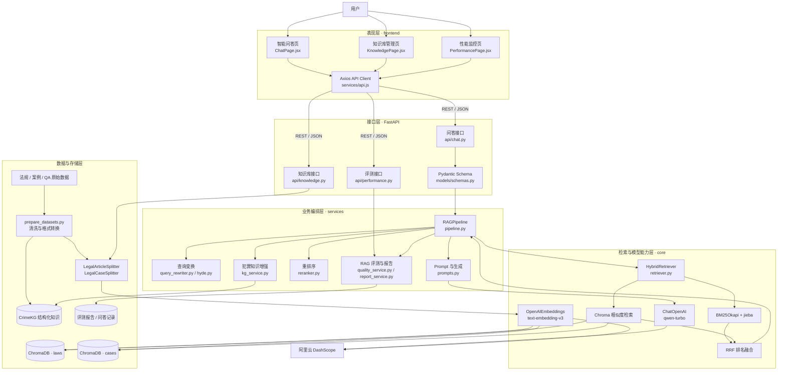
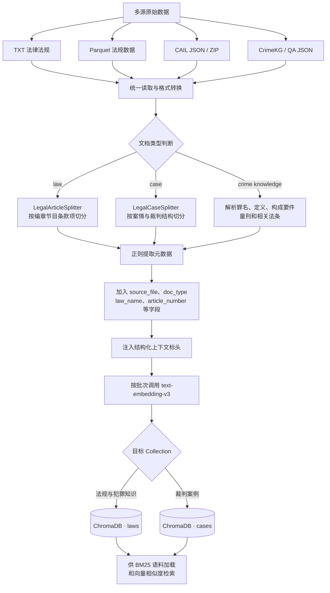
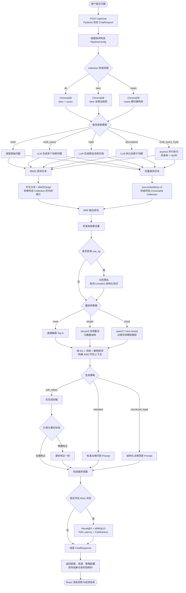

# LawRAG：法律检索增强问答系统

LawRAG 是一个面向中国法律咨询场景的检索增强生成（Retrieval-Augmented Generation，RAG）项目。系统将法律法规、裁判案例和犯罪知识整理为可检索知识库，在回答问题前先查找依据，再由大语言模型结合检索结果生成回答。

项目采用前后端分离架构：后端使用 FastAPI 和 LangChain 编排 RAG 流程，ChromaDB 保存向量索引，DashScope 提供生成与向量模型；前端使用 React 构建问答、知识库管理和性能评测页面。

> 一句话理解：LawRAG 不是让模型仅凭参数记忆回答法律问题，而是先从法律知识库寻找证据，再基于证据组织答案。

## 目录

1. [项目概述](#1-项目概述)
2. [系统架构与技术选型](#2-系统架构与技术选型)
3. [数据准备与知识库构建](#3-数据准备与知识库构建)
4. [一次问答的完整执行流程](#4-一次问答的完整执行流程)
5. [系统实现与接口设计](#5-系统实现与接口设计)
6. [环境配置与项目运行](#6-环境配置与项目运行)
7. [测试评测与质量保障](#7-测试评测与质量保障)

---

## 1. 项目概述

**本章使用的核心技术**：RAG、领域知识库、法律文本结构化、混合检索。本章介绍项目目标与业务价值，其余章节展开具体技术实现。

### 1.1 为什么要做法律 RAG

通用大语言模型能够生成流畅的法律回答，但如果只依赖模型参数，仍然存在三个核心问题：

1. **知识不可控**：模型训练数据的时间范围不透明，可能不了解最新法规或仍引用失效条文；
2. **依据不可追溯**：答案看似合理，却无法说明结论来自哪部法律、哪一条规定或哪个案例；
3. **专业表达存在鸿沟**：用户常用“打人”“欠钱不还”“酒驾”等口语提问，而法律材料使用“故意伤害”“民间借贷”“危险驾驶”等正式术语。

RAG 将问题拆成“检索”和“生成”两部分：检索模块负责从受控知识库中找出证据，生成模块根据问题和证据组织回答。这样既使用了大模型的语言理解能力，也让答案尽量建立在明确资料之上。

### 1.2 项目目标

LawRAG 围绕法律文本特点实现以下能力：

- 以法律“编、章、节、条、款、项”结构进行分块，尽量保持法条语义完整；
- 对法律法规和裁判案例采用不同的分块策略；
- 结合 BM25 关键词检索与向量语义检索，提高精确匹配和语义召回能力；
- 支持多查询改写、HyDE、问题分解等查询变换策略；
- 使用结构化犯罪知识补充罪名定义、构成要件和量刑信息；
- 支持不重排、轻量重排和云端专用 Reranker，并提供多种答案生成方式；
- 返回参考来源和各阶段耗时，便于分析系统行为；
- 提供知识库管理、问答配置、性能测试和报告导出页面。

### 1.3 数据规模

系统建立了两类 ChromaDB Collection：

| Collection | 内容 | 向量记录数 |
|---|---|---:|
| `laws` | 法律法规、司法材料、犯罪结构化知识 | 35,242 |
| `cases` | 经过预处理的裁判案例 | 5,000 |
| 合计 | 法律知识库 | 40,242 |

原始数据与向量库通过 `.gitignore` 和代码仓库分离，部署流程使用数据准备脚本构建独立的本地索引。

---

## 2. 系统架构与技术选型

**本章使用的核心技术**：React、FastAPI、Pydantic、LangChain、ChromaDB、BM25、DashScope。系统按表现层、接口层、业务编排层、能力层和数据层分层，离线建库与在线问答共用同一套知识存储。

### 2.1 总体架构



系统包含两条主链路：

- **离线建库链路**：原始数据 → 格式转换 → 元数据提取 → 结构化分块 → Embedding → ChromaDB；
- **在线问答链路**：用户问题 → 查询变换 → 混合检索 → 知识增强 → 重排序 → 答案生成。

离线建库只在首次导入或知识库变化时执行，在线问答则在每次用户提问时执行。

### 2.2 技术栈

| 层级 | 技术 | 作用 |
|---|---|---|
| 前端 | React 18、Vite、Axios、Recharts | 交互界面、接口调用、性能图表 |
| Web 后端 | FastAPI、Pydantic | REST API、参数校验、响应模型 |
| RAG 编排 | LangChain | 文档对象、Prompt、模型链和检索器接口 |
| 生成模型 | DashScope `qwen-turbo` | 查询改写、答案生成、可选评测 |
| 向量模型 | DashScope `text-embedding-v3` | 文本向量化和语义查询 |
| 向量数据库 | ChromaDB | 保存法规与案例向量及元数据 |
| 云端重排 | DashScope `qwen3.7-text-rerank` | 对混合检索候选文档进行二次精排 |
| 稀疏检索 | `rank-bm25`、jieba | 中文分词和关键词匹配 |
| RAG 评测 | 人工相关文档标注、LLM Judge | Recall@5、MRR@10、P95 Latency、Faithfulness |
| 系统监控 | psutil | CPU 和内存使用率采集 |

### 2.3 为什么使用混合检索

法律问题同时需要“精确匹配”和“语义理解”。例如，“民法典第五百零九条”包含明确编号，BM25 更容易准确命中；“公司一直不给我发工资怎么办”与法条原文用词差异较大，向量检索更适合发现语义相关内容。

系统将 BM25 和向量检索的排名通过 RRF（Reciprocal Rank Fusion）合并。对排名为 `rank` 的文档，其贡献可简化表示为：

```text
RRF_score = weight / (60 + rank + 1)
```

同一文档如果被两种检索器同时命中，会累加两部分分数，从而获得更靠前的最终排名。默认 BM25 和向量检索权重均为 `0.5`。

---

## 3. 数据准备与知识库构建

**本章使用的核心技术**：Python 文件处理、PyArrow、JSON/JSONL、正则表达式、LangChain `RecursiveCharacterTextSplitter`、`OpenAIEmbeddings` 和 ChromaDB。目标是把不同格式的原始数据转换为统一的 `Document + metadata + vector` 结构。

### 3.1 数据来源

| 数据集 | 主要内容 | 在项目中的用途 |
|---|---|---|
| [Chinese-Laws](https://modelscope.cn/datasets/dengcao/Chinese-Laws) | 中国法律法规 TXT 文本 | 法律条文检索 |
| [Chinese Law and Regulations](https://huggingface.co/datasets/twang2218/chinese-law-and-regulations) | 法律法规结构化数据 | 补充法规覆盖范围 |
| [CrimeKgAssitant](https://github.com/liuhuanyong/CrimeKgAssitant) | 罪名知识和法律问答 | 犯罪知识增强、参考答案 |
| [CAIL](https://github.com/thunlp/CAIL) | 中文法律案例数据 | 案例检索与测试 |
| CAIL2018 | 刑事案件事实与标签 | 构建案例 Collection |

原始数据统一存放在 `backend/data/` 下：

```text
backend/data/
├── laws/
│   ├── Chinese-Laws/
│   ├── HF_Chinese_Laws/
│   └── CrimeKG/
├── cases/
│   ├── CAIL2018/
│   └── CAIL2019-SCM/
├── qa/
├── reference/
├── reports/
└── chat_records/
```

### 3.2 数据预处理

运行 `scripts.prepare_datasets` 后，系统会执行以下转换：

1. 将 Hugging Face Parquet 法规筛选并转换为独立 TXT 文件；
2. 解压并读取 CAIL2018 数据，将案件事实和标签整理为 JSONL；
3. 从 CrimeKgAssitant 中提取罪名定义、构成要件、量刑和相关法条；
4. 整理评测问题及相关法律文档标注，生成 RAG 检索评测集；
5. 生成后续导入脚本能够统一读取的目录和文件格式。

该阶段执行确定性的本地文件转换，并支持按需下载 DISC-Law-SFT；模型调用统一集中在向量导入和在线问答阶段。

完整建库流程如下。图中的前半部分由 `prepare_datasets.py` 完成，后半部分由 `import_data.py` 完成：



这条链路体现了三个技术层次：格式转换解决数据源不统一，领域分块解决法律语义边界，Embedding 与 ChromaDB 则负责把文本转换为可执行的语义检索索引。

### 3.3 法律结构化分块

普通 RAG 常按固定字符或 Token 窗口切分文档。但如果在法条中间直接切开，适用条件与法律后果可能被分到两个 Chunk，检索后只能得到半条规则。

LawRAG 为两类文本分别设计分块器：

| 文档类型 | 优先分隔结构 | 默认分块参数 |
|---|---|---|
| 法律法规 | 编 → 章 → 节 → 条 → 款 → 项 → 换行 | 512 字符，64 字符重叠 |
| 裁判案例 | 裁判要旨 → 基本案情 → 裁判理由 → 裁判结果 | 1,024 字符，128 字符重叠 |

分块后还会保存法律名称、章节、条号、生效日期、源文件、案例名称、案号、关键词、段落类型和 Chunk 序号等元数据。

### 3.4 上下文标头注入

单独看一句“当事人应当按照约定全面履行自己的义务”，Embedding 模型并不知道它属于哪部法律。为减少 Chunk 脱离上下文的问题，系统会在向量化前加入结构化标头：

```text
[法律名称: 中华人民共和国民法典 | 章节: 第四章 合同的履行 | 条号: 第509条]
当事人应当按照约定全面履行自己的义务……
```

标头来自文档结构和正则提取结果，不需要额外调用 LLM。

### 3.5 向量入库

`scripts.import_data` 负责最终导入：

```text
读取本地文件
  → 尝试 UTF-8 / GBK / GB2312 编码
  → 判断法规或案例类型
  → 结构化分块和元数据增强
  → 批量请求 text-embedding-v3
  → 写入 laws 或 cases Collection
```

法规以批次写入 `laws`，案例从 JSONL 中抽取事实、罪名、法条等信息后写入 `cases`。当前脚本默认最多导入 5,000 条案例。

> 资源说明：`python -m scripts.import_data` 会为全部 Chunk 请求 Embedding。索引与 Embedding 模型版本绑定，数据或模型发生变化时执行重建。

---

## 4. 一次问答的完整执行流程

**本章使用的核心技术**：FastAPI 异步接口、Pydantic 参数校验、`dataclass + Enum` 策略配置、LangChain LCEL、BM25、向量检索、RRF、`asyncio` 并行任务、Prompt Engineering 和 LLM-as-a-Judge。

用户提交问题后，请求会发送到 `POST /api/chat`。后端根据策略参数构造 `PipelineConfig`，随后由 `RAGPipeline.execute()` 依次执行四个主阶段。



每次问答都访问同一个本地 ChromaDB 持久化目录 `backend/chroma_db`，具体查询哪个 Collection 由请求参数 `collection` 决定：

| `collection` 参数 | 实际查询的 ChromaDB Collection | 数据内容 |
|---|---|---|
| `all` | `laws` + `cases` | 同时查询法律法规与裁判案例，分别召回后统一融合 |
| `laws` | `laws` | 法律法规、司法解释和犯罪结构化知识 |
| `cases` | `cases` | 裁判案例与指导案例 |

查询变换产生的每个原始问题、改写问题或子问题，都会在上述选定 Collection 中执行检索。普通向量查询使用问题文本，HyDE 使用生成的假设法律文档作为向量查询文本。BM25 不访问另一套数据库，而是从同一批 ChromaDB Collection 文档加载并构建内存关键词索引，因此稀疏检索和向量检索的数据范围保持一致。

流程图中的每个阶段都可以定位到具体实现：

| 阶段 | 采用技术 | 主要源码 | 是否调用云模型 |
|---|---|---|---|
| 请求接收 | FastAPI、Pydantic | `api/chat.py`、`models/schemas.py` | 否 |
| 管线配置 | Python `dataclass`、`Enum`、策略模式 | `services/pipeline.py` | 否 |
| 多查询改写 | LangChain Prompt、`ChatOpenAI` | `services/query_rewriter.py` | 是 |
| HyDE | 假设文档生成、查询与文档空间对齐 | `services/hyde.py` | 是 |
| 问题分解 | LLM 结构化拆分 | `services/query_rewriter.py` | 是 |
| BM25 召回 | jieba、`rank_bm25.BM25Okapi`；索引范围与所选 Collection 一致 | `core/retriever.py` | 否 |
| 向量召回 | `OpenAIEmbeddings`；按请求查询 ChromaDB 的 `laws`、`cases` 或两者 | `core/embeddings.py`、`core/vectorstore.py` | 每个向量查询文本需要一次 Embedding |
| 融合与去重 | RRF、内容哈希、Top K | `core/retriever.py`、`services/pipeline.py` | 否 |
| 犯罪知识增强 | 罪名识别、内存字典查找、LangChain `Document` | `services/kg_service.py` | 罪名识别会调用 LLM |
| 轻量重排序 | Jaccard、jieba、法律元数据加权 | `services/reranker.py` | 否 |
| 云端专用重排序 | HTTPX、`qwen3.7-text-rerank` | `services/cloud_reranker.py` | 仅选择 `cloud` 时调用 |
| 上下文构建 | 文档优先级、字符预算、来源格式化 | `services/pipeline.py` | 否 |
| 答案生成 | LCEL `prompt \| llm`、Qwen | `services/prompts.py`、`core/llm.py` | 是 |
| 自我反思 | 引用检查、一次纠错上限 | `services/self_reflect.py` | 仅 `self_reflect` 策略调用 |
| RAG 评测 | 相关文档标注、排名指标、LLM-as-a-Judge | `services/quality_service.py`、`services/perf_service.py` | 检索和延迟指标否，Faithfulness 是 |
| 响应展示 | Pydantic、Axios、React Markdown | `models/schemas.py`、`ChatPage.jsx` | 否 |

### 4.1 查询变换

查询变换用于缩小用户表达与法律材料之间的差异：

| 策略 | 执行方式 | 适用场景 |
|---|---|---|
| `none` | 直接使用原问题 | 问题清晰、追求低成本 |
| `multi_query` | 从不同角度生成多个查询 | 表述模糊或涉及多个术语 |
| `hyde` | 生成假设法律文本用于向量查询 | 口语问题与法条差异较大 |
| `decompose` | 将复杂问题拆成多个子问题 | 一个问题包含多个法律关系 |
| `multi_query_hyde` | 并行执行多查询和 HyDE | 追求召回范围，允许更高成本 |

HyDE 采用“分离式检索”：原始问题交给 BM25，以保留关键词；假设文档交给向量检索，以缩小问题文本与法律文本之间的语义差异。

### 4.2 混合检索

混合检索器从 ChromaDB 读取指定 Collection 的文档，并用 jieba 分词建立内存 BM25 索引。收到查询后：

1. BM25 返回关键词匹配排名；
2. ChromaDB 返回向量相似度排名；
3. RRF 根据排名和权重累加分数；
4. 按融合分数排序并返回候选文档；
5. 多查询产生的重复文档按内容去重。

用户可以只检索法规、只检索案例，或者同时检索两个 Collection。

### 4.3 犯罪知识增强

启用 `use_kg` 后，系统从问题中识别罪名，并在 CrimeKG 转换得到的结构化知识中精确查找定义、构成要件、量刑和相关法条。命中结果会作为高优先级文档并入检索结果。

犯罪知识模块采用轻量结构化查找：将罪名映射到定义、构成要件、量刑和关联法条，以常数时间完成精确查询，省去独立图数据库的部署与维护成本。

### 4.4 重排序

初步召回强调“尽量找到”，重排序强调“把最有用的资料放在前面”：

- `none`：直接截取前 `top_k` 条；
- `simple`：根据词项重合度和法律名称、条号、案号等元数据加权；
- `cloud`：将融合后的候选文档批量提交给 `qwen3.7-text-rerank`，根据返回的 `relevance_score` 取 Top K。

三种策略分别承担实验基线、零云调用轻量排序和生产级云端精排职责。启用重排后，管线将混合检索候选池扩大到 20 条，再选出最终 Top K。默认 `simple` 提供零云端调用的快速路径；`cloud` 调用专用排序模型完成高精度排序。管线内置自动降级机制，云端超时、限流或服务异常时切换到 `simple`，并通过 `rerank_fallback` 指标记录实际执行路径。

### 4.5 上下文构建与答案生成

系统按照“犯罪结构化知识 > 法律法规 > 裁判案例 > 其他文档”的优先级组织上下文。每段资料带有来源标签，总上下文默认限制在约 4,000 字符以内，避免无关内容挤占模型上下文。

| 生成策略 | 输出特点 |
|---|---|
| `standard` | 基于资料直接回答 |
| `structured_legal` | 输出法律结论、适用依据、分析和注意事项 |
| `self_reflect` | 首次生成后检查引用和事实，必要时修正一次 |

三种策略分别承担快速基线、法律场景结构化输出和高质量纠错职责。复杂法律分析统一由 `structured_legal` 输出结论、依据和详细分析，不再设置功能重叠的独立链式推理策略。

最终响应还包括来源文档、查询改写结果、识别罪名、实际管线配置，以及查询变换、检索、KG、重排、生成和总耗时。

---

## 5. 系统实现与接口设计

**本章使用的核心技术**：FastAPI Router、Pydantic BaseModel、REST/JSON、React Hooks、Axios、React Markdown 和 Recharts。后端负责管线与数据，前端负责配置、展示和操作，两者通过稳定的数据模型解耦。

### 5.1 后端分层

```text
backend/
├── app/
│   ├── api/                 # 问答、知识库、性能接口
│   ├── core/                # LLM、Embedding、ChromaDB、检索器
│   ├── models/              # Pydantic 请求与响应模型
│   ├── services/            # RAG 管线及各项策略
│   ├── utils/               # 法律分块和元数据工具
│   ├── config.py            # 环境变量与默认配置
│   └── main.py              # FastAPI 应用入口
├── scripts/                 # 数据准备、导入和评测脚本
├── tests/                   # 单元测试
├── data/                    # 本地数据和运行产物
└── chroma_db/               # 本地向量数据库
```

`services/pipeline.py` 是在线问答主入口。它通过枚举和 `PipelineConfig` 将查询变换、重排序、生成策略解耦，使前端能够组合不同流程，而无需复制整套问答代码。

### 5.2 主要 API

后端默认运行在 `http://127.0.0.1:8000`，接口统一使用 `/api` 前缀。启动后可访问 `/docs` 查看 Swagger 文档。

| 方法 | 路径 | 功能 |
|---|---|---|
| `GET` | `/` | 项目基本信息 |
| `GET` | `/health` | 服务和模型配置状态 |
| `POST` | `/api/chat` | 执行可配置 RAG 问答 |
| `POST` | `/api/chat/save-record` | 保存问答记录 |
| `GET` | `/api/chat/records` | 查询问答记录 |
| `POST` | `/api/knowledge/upload` | 上传法规或案例文件 |
| `GET` | `/api/knowledge/list` | 列出知识库文件 |
| `DELETE` | `/api/knowledge/{filename}` | 删除指定文件 |
| `POST` | `/api/knowledge/rebuild` | 重建向量索引 |
| `GET` | `/api/knowledge/stats` | 查询文件和 Chunk 数量 |
| `GET` | `/api/performance/system` | 查询 CPU 和内存状态 |
| `POST` | `/api/performance/bench` | 执行性能或质量测试 |
| `POST` | `/api/performance/report` | 生成并保存测试报告 |
| `GET` | `/api/performance/reports` | 查询历史报告 |

基础问答请求示例：

```json
{
  "question": "公司拖欠工资三个月，员工应该如何维权？",
  "collection": "all",
  "query_transform": "none",
  "rerank_strategy": "simple",
  "generation_strategy": "standard",
  "use_kg": false,
  "top_k": 5,
  "evaluate_quality": false
}
```

### 5.3 前端页面

- **智能问答**：输入问题，配置 Collection、查询变换、重排、KG 和生成策略，查看回答、来源及阶段耗时；
- **知识库管理**：查看文件与 Chunk 数量，上传 TXT、Markdown 或 JSON 文件，删除文件并重建索引；
- **性能监控**：查看 CPU/内存，执行基准测试，展示延迟分解和质量指标，导出历史报告。

Vite 开发服务器默认运行在 `http://127.0.0.1:5173`，并将 `/api` 请求代理到后端 `8000` 端口。

---

## 6. 环境配置与项目运行

**本章使用的核心技术**：Python `venv`、pip、Node.js、npm、Uvicorn、Vite、`pydantic-settings` 和环境变量。模型密钥与代码分离，后端与前端分别运行并通过开发代理通信。

### 6.1 环境要求

- Python 3.10 或更高版本；
- Node.js 18 或更高版本；
- 可访问 DashScope 的网络环境和 API Key；
- 8 GB 以上磁盘空间，用于保存数据、依赖和向量索引。

模型层使用 `qwen-turbo`、`text-embedding-v3`、`qwen3.7-text-rerank` 和 DashScope API。

### 6.2 安装后端

```powershell
cd "D:\LLM study\LawRAG\LawRAG\backend"
py -m venv .venv
.\.venv\Scripts\Activate.ps1
python -m pip install --upgrade pip
pip install -r requirements.txt
$env:DASHSCOPE_API_KEY="sk-your-api-key"
```

也可以在 `backend/.env` 中配置：

```env
DASHSCOPE_API_KEY=sk-your-api-key
DASHSCOPE_WORKSPACE_ID=your-workspace-id
LLM_MODEL=qwen-turbo
EMBEDDING_MODEL=text-embedding-v3
DASHSCOPE_BASE_URL=https://dashscope.aliyuncs.com/compatible-mode/v1
RERANKER_MODEL=qwen3.7-text-rerank
RERANKER_CANDIDATE_K=20
RERANKER_DOCUMENT_MAX_CHARS=1200
```

复制 `backend/.env.example` 为 `backend/.env` 并填写环境变量。真实密钥仅保存在 `.env`，该文件已被 Git 忽略。云端 Reranker 使用带业务空间 ID 的独立文本排序 Endpoint，Chat 和 Embedding 使用 OpenAI 兼容地址。

### 6.3 准备数据与建立索引

```powershell
cd "D:\LLM study\LawRAG\LawRAG\backend"
python -m scripts.prepare_datasets
python -m scripts.import_data
```

第一条命令完成本地格式转换，第二条命令批量调用 `text-embedding-v3` 并生成 ChromaDB 索引。索引构建完成后可直接启动问答服务。

### 6.4 启动后端和前端

后端：

```powershell
cd "D:\LLM study\LawRAG\LawRAG\backend"
.\.venv\Scripts\Activate.ps1
uvicorn app.main:app --host 127.0.0.1 --port 8000 --reload
```

前端使用另一个终端启动：

```powershell
cd "D:\LLM study\LawRAG\LawRAG\frontend"
npm install
npm run dev
```

访问地址：

- 前端界面：`http://127.0.0.1:5173`
- 后端文档：`http://127.0.0.1:8000/docs`
- 健康检查：`http://127.0.0.1:8000/health`

模型调用发生在问答、查询变换、云端重排、Faithfulness 评测和索引构建阶段；Recall@5、MRR@10 与 P95 Latency 的计算不额外调用模型。

---

## 7. 测试、评测与质量保障

**本章使用的核心技术**：pytest、人工相关文档标注、排名指标、LLM-as-a-Judge、psutil 和 JSON 报告。测试负责验证确定性代码，评测从检索、生成和端到端延迟三个层面衡量 RAG 系统。

### 7.1 单元测试

项目使用离线单元测试覆盖管线基础能力与 RAG 指标计算：

| 测试文件 | 覆盖内容 |
|---|---|
| `test_basic.py` | 配置、法律分块、案例分块、元数据格式化 |
| `test_pipeline.py` | 管线默认值、策略枚举、兼容参数映射 |
| `test_advanced_retrieval.py` | 法律术语规范化、上下文标头 |
| `test_kg.py` | 犯罪知识加载和罪名查找 |
| `test_cloud_reranker.py` | 云端排序请求格式、响应映射、配置检查和无网络降级 |
| `test_rag_evaluation.py` | Recall@5、MRR@10、指标聚合和 P95 计算 |

```powershell
cd backend
pip install pytest
pytest tests -v
```

测试套件将模型和网络依赖替换为可控 Mock。云端重排测试通过 `httpx.MockTransport` 验证请求、响应、排序映射与降级逻辑，形成稳定的离线回归环境。

### 7.2 RAG 核心评测

项目将评测指标收敛为四项核心指标：

| 指标 | 评测对象 | 计算方式 |
|---|---|---|
| Recall@5 | 召回覆盖率 | Top 5 命中的标准相关文档数 / 标准相关文档总数 |
| MRR@10 | 检索排序 | Top 10 中第一个相关文档排名的倒数；未命中记为 0 |
| P95 Latency | 端到端性能 | 批量请求延迟升序排列后的第 95 百分位值 |
| Faithfulness | 回答忠实度 | LLM Judge 判断答案是否得到检索来源支持，分值范围 0～10 |

评测数据位于 `backend/data/rag_eval_dataset.json`。每条样本包含问题、法律领域和 `relevant_documents` 标注；标注通过 `law_name`、`article_number`、`source_file` 或 `content_contains` 与召回文档元数据匹配。Recall@5 和 MRR@10 直接使用这些人工标注离线计算。

```powershell
python -m scripts.run_integration_test
python -m scripts.run_quality_eval
```

`run_integration_test` 使用 40 个问题验证多种策略组合；`run_quality_eval` 读取标准评测集，统一输出四项核心指标并将完整结果保存到 `backend/data/reports/rag_eval_results.json`。其中 Recall@5、MRR@10 和 P95 Latency 不需要额外 Judge 调用，Faithfulness 在显式运行完整评测时调用 LLM Judge。

### 7.3 工程质量设计

项目通过以下机制保证管线稳定性和结果可分析性：

- **策略可替换**：查询变换、重排序和生成分别由枚举配置，支持独立组合与对比；
- **云端调用隔离**：模型客户端按需初始化，服务启动与单元测试保持零外部调用；
- **重排自动降级**：云端排序异常时切换到轻量算法，并将降级状态写入响应指标；
- **请求可观测**：记录查询变换、检索、知识增强、重排、生成和总耗时；
- **效果可量化**：统一计算 Recall@5、MRR@10、P95 Latency 和 Faithfulness；
- **结果可追溯**：回答同步返回来源内容、法律元数据、重排分数和排序位置；
- **报告可沉淀**：性能测试、质量指标和问答记录均可保存并下载为 JSON；
- **数据与代码分离**：数据集、向量索引、密钥和运行产物通过目录规范独立管理。
